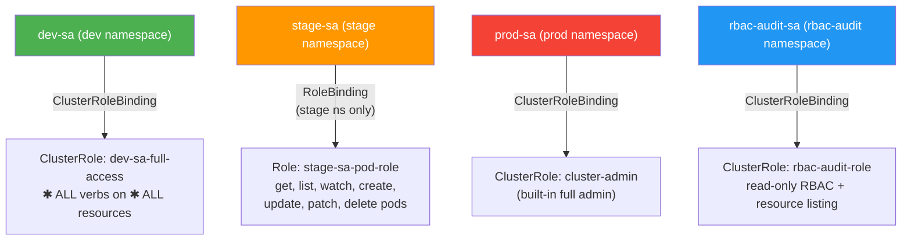

# RBAC Enumeration with rbac-tool (Rapid7)

Demonstrates how to enumerate, visualize, and audit Kubernetes RBAC configurations using [rbac-tool](https://github.com/alcideio/rbac-tool) from Rapid7. The lab deploys a Kind cluster with multiple namespaces, service accounts, and varying privilege levels to showcase what rbac-tool reveals about your cluster's RBAC posture.

## What is rbac-tool?

An open-source Kubernetes RBAC power tool by Rapid7 (insightCloudSec) that lets you visualize, analyze, generate, and query RBAC policies. Instead of manually parsing Roles, ClusterRoles, and their bindings, rbac-tool gives you one-command answers to questions like "who can delete pods?" or "what can this service account do?".

## Install

### Standalone (Linux/macOS)
Downloads the latest binary from GitHub releases.
```bash
curl https://raw.githubusercontent.com/alcideio/rbac-tool/master/download.sh | bash
```

### kubectl Plugin via Krew
Installs as a kubectl plugin — all commands become `kubectl rbac-tool <command>`.
```bash
kubectl krew install rbac-tool
```

### Verify Installation
```bash
rbac-tool version
```

---

## Key Commands

| Command | What It Does |
|---------|-------------|
| `rbac-tool whoami` | Shows the identity (user/group/SA) of the current kubeconfig context |
| `rbac-tool lookup` | Looks up RBAC bindings by subject — find what a user/group/SA is bound to |
| `rbac-tool who-can` | Reverse query — shows which subjects can perform a specific action on a resource |
| `rbac-tool policy-rules` | Lists the effective policy rules for a given subject |
| `rbac-tool viz` | Generates an RBAC graph (HTML or DOT format) visualizing all bindings |
| `rbac-tool analysis` | Analyzes RBAC for overly permissive principals, risky permissions, and misconfigurations |
| `rbac-tool generate` | Generates least-privilege Role/ClusterRole YAML and reduces wildcard usage |
| `rbac-tool show` | Generates a ClusterRole with every available permission in the cluster (useful for auditing) |
| `rbac-tool auditgen` | Generates RBAC policy from Kubernetes audit log events |

---

## Lab Setup

### Prerequisites
- [Kind](https://kind.sigs.k8s.io/) installed
- kubectl installed
- rbac-tool installed (see above)

### Deploy the Lab Cluster

Create the Kind cluster and apply the lab configuration.
```bash
kind create cluster --name rbac-tool-lab
kubectl apply -f cluster-config/
```

### What Gets Deployed

| Component | Namespace | Purpose |
|-----------|-----------|---------|
| `nginx` Pod | `dev` | Workload in development namespace |
| `nginx` Pod | `stage` | Workload in staging namespace |
| `nginx` Pod | `prod` | Workload in production namespace |
| `dev-sa` ServiceAccount | `dev` | Full wildcard access to everything (`*/*` verbs via ClusterRoleBinding) |
| `stage-sa` ServiceAccount | `stage` | Pod-level actions only, scoped to `stage` namespace (Role + RoleBinding) |
| `prod-sa` ServiceAccount | `prod` | `cluster-admin` ClusterRole bound via ClusterRoleBinding |
| `rbac-audit-sa` ServiceAccount | `rbac-audit` | Least-privilege SA with only the permissions needed to run rbac-tool |

### RBAC Privilege Map



---

## Demo Walkthrough

### 1. Check Your Identity
```bash
rbac-tool whoami
```

### 2. Look Up Bindings for Each Service Account
Shows what Roles/ClusterRoles are bound to each SA.
```bash
rbac-tool lookup -e 'dev-sa'
rbac-tool lookup -e 'stage-sa'
rbac-tool lookup -e 'prod-sa'
rbac-tool lookup -e 'rbac-audit-sa'
```

### 3. Check Who Can Perform Dangerous Actions
Find which subjects can delete pods, create secrets, or escalate privileges.
```bash
rbac-tool who-can delete pods
rbac-tool who-can create secrets
rbac-tool who-can '*' '*'
```

### 4. List Effective Policy Rules
See the full permission set for each service account.
```bash
rbac-tool policy-rules -e 'dev-sa'
rbac-tool policy-rules -e 'stage-sa'
rbac-tool policy-rules -e 'prod-sa'
```

### 5. Visualize the RBAC Graph
Generates an HTML visualization of the cluster's RBAC bindings.
```bash
rbac-tool viz --outformat html > rbac-viz.html
```
Open `rbac-viz.html` in a browser to explore the interactive graph.

### 6. Run RBAC Analysis
Highlight overly permissive principals and risky configurations.
```bash
rbac-tool analysis
```

### 7. Demo with Least-Privilege SA (rbac-audit-sa)
Shows that rbac-tool works with minimal permissions — you don't need `cluster-admin` to audit RBAC.
```bash
# Create a kubeconfig token for the rbac-audit-sa
TOKEN=$(kubectl create token rbac-audit-sa -n rbac-audit --duration=1h)
# Set up a context using the least-privilege SA
kubectl config set-credentials rbac-audit-user --token="$TOKEN"
kubectl config set-context rbac-audit-ctx --cluster=kind-rbac-tool-lab --user=rbac-audit-user
kubectl config use-context rbac-audit-ctx

# Now run rbac-tool — it works with just the read-only RBAC permissions
rbac-tool whoami
rbac-tool lookup
rbac-tool who-can delete pods
rbac-tool viz --outformat html > rbac-viz-audit.html
rbac-tool analysis

# Switch back to admin context when done
kubectl config use-context kind-rbac-tool-lab
```

---

## Clean Up

```bash
kind delete cluster --name rbac-tool-lab
```

## File Structure

```
rbac-tool-demo/
├── README.md                           # This file — tool overview, install, demo walkthrough
└── cluster-config/
    ├── 00-namespaces.yaml              # dev, stage, prod, rbac-audit namespaces
    ├── 01-service-accounts.yaml        # dev-sa, stage-sa, prod-sa, rbac-audit-sa
    ├── 02-dev-rbac.yaml                # ClusterRole + ClusterRoleBinding — full wildcard access
    ├── 03-stage-rbac.yaml              # Role + RoleBinding — pod actions in stage ns only
    ├── 04-prod-rbac.yaml               # ClusterRoleBinding — cluster-admin
    ├── 05-rbac-audit-rbac.yaml         # ClusterRole + ClusterRoleBinding — least-privilege for rbac-tool
    └── 06-workloads.yaml               # nginx pods in dev, stage, prod
```
