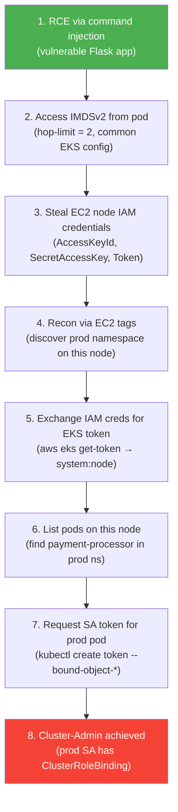

# Scenario 1: EKS Privilege Escalation — Pod RCE to Cluster-Admin

Demonstrates how a simple command injection in a pod leads to full EKS cluster takeover through common misconfigurations. No elevated pod privileges needed — the attack leverages the EC2 node's IAM role and Kubernetes RBAC.

Based on [Privilege Escalation in EKS — Calif.io](https://blog.calif.io/p/privilege-escalation-in-eks).

## Attack Chain



## Why It Works (Common EKS Settings)

| Setting | What it means | Why it matters |
|---------|---------------|----------------|
| IMDS hop limit = **2** (commonly set for EBS CSI, IRSA) | Containers can reach `169.254.169.254` across the network namespace boundary | Any pod can steal the node's IAM credentials |
| Node IAM → `system:node` | `aws-iam-authenticator` maps the node's IAM role to Kubernetes `system:node` identity | Stolen IAM creds give you a valid K8s identity |
| NodeRestriction allows `TokenRequest` | A node can request service account tokens for pods **bound to that node** | You can impersonate any SA on pods co-located with you — even across namespaces |
| No pod-level IAM by default | Pods inherit the node's IAM role unless IRSA/Pod Identity is configured | The blast radius of a single compromised pod extends to the entire node's permissions |

## Prerequisites

- EKS cluster deployed via [`initial-lab-deploy-trfm/`](../initial-lab-deploy-trfm/)
- Docker, AWS CLI, kubectl, Terraform installed

## Deploy

```bash
chmod +x scripts/deploy.sh scripts/cleanup.sh
./scripts/deploy.sh "$(curl -s https://checkip.amazonaws.com)/32"
```

Terraform handles everything — ECR repo, Docker build/push, K8s resources, node labeling, EC2 tags, and the IP-whitelisted LoadBalancer.

## What Gets Deployed

| Component | Namespace | Purpose |
|-----------|-----------|---------|
| `health-dashboard` | `default` | Vulnerable Flask app (command injection) exposed via Classic ELB |
| `payment-processor` | `prod` | BusyBox pod with `cluster-admin` service account (the target) |

Both pods co-located on the same node via `nodeSelector`. EC2 tags (`Environment: production`) added for attacker recon.

## Exploit Steps

See [CHEATSHEET.md](CHEATSHEET.md) for the step-by-step commands.

## Mitigations

1. **IMDS hop limit = 1** — blocks pods from reaching instance metadata
2. **IRSA / EKS Pod Identity** — pods get scoped IAM roles, not the node's
3. **Least-privilege RBAC** — no `cluster-admin` on workload SAs
4. **Network Policies** — block `169.254.169.254/32` egress

## Clean Up

```bash
./scripts/cleanup.sh
```

## File Structure

```
scenario1/
├── vulnerable-app/          # Flask app with command injection + Dockerfile
├── terraform/               # Everything — ECR, K8s resources, node config
│   ├── providers.tf         # AWS + Kubernetes providers
│   ├── variables.tf         # region, cluster_name, allowed_ip
│   ├── main.tf              # ECR repo + Docker build/push
│   ├── kubernetes.tf        # Namespaces, RBAC, Deployment, Service, Pod
│   ├── node.tf              # Node label + EC2 tags
│   └── outputs.tf           # App URL, node info
└── scripts/
    ├── deploy.sh            # Thin wrapper → terraform apply
    └── cleanup.sh           # Thin wrapper → terraform destroy
```
